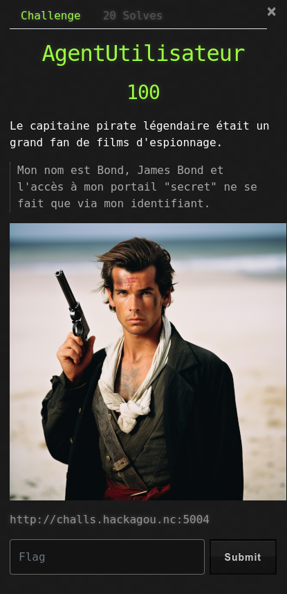
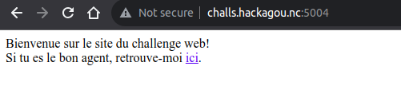
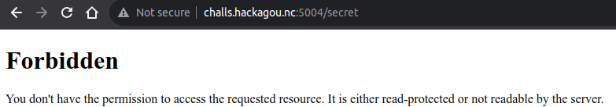

# AgentUtilisateur



## Write-Up

Lorsque l'on se connecte sur le site, on retrouve une page d'accueil nous invitant à accéder à un espace "secret".



L'accès semble interdit.



Le nom du challenge étant AgentUtilisateur, cela ressemble fortement à un User-Agent que l'on peut retrouver dans une requête HTTP. Le thème du challenge est sur l'espionnage, avec une image ressemblant à un James Bond pirate, on peut essayer un User-Agent à "007".

```
$ curl -H "User-Agent: 007" http://challs.hackagou.nc:5004/secret
Félicitations! Voici le flag: OPENNC{w3b_3xpl01t}
```
