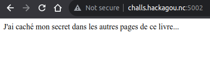
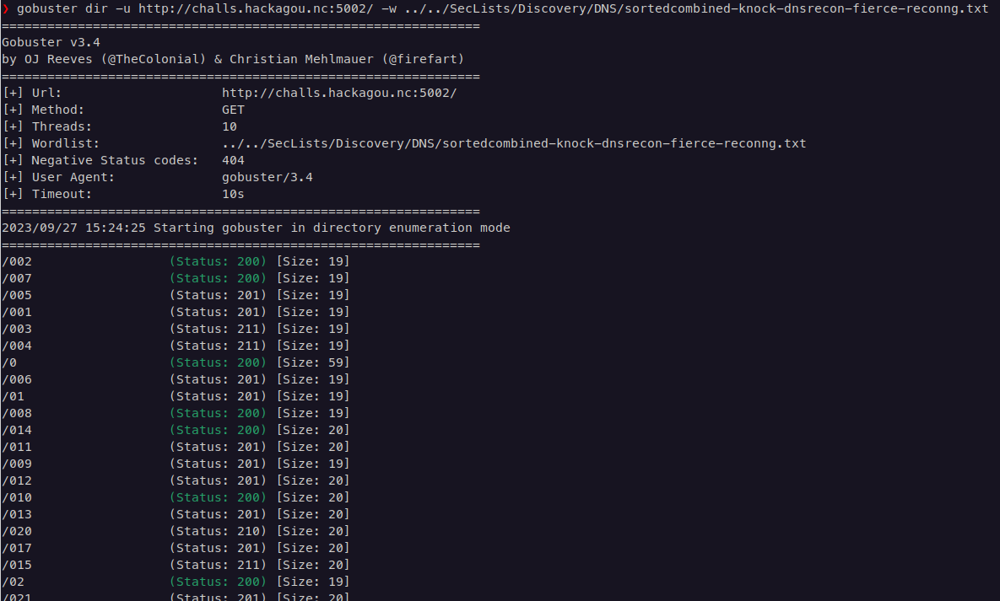
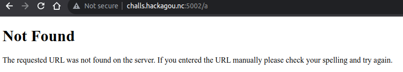
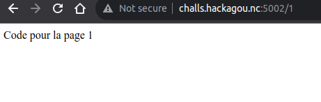

# AnswerMe


## Write-Up

Lorsque l'on se connecte sur le site, on retrouve une page d'accueil nous invitant à trouver un secret dans les pages de ce livre. Aucun lien n'est proposé.



Un gobuster nous remonte des codes de retour assez spéciaux en fonction de l'URL recherché, si c'est une chaîne de caractères, nous avons un 404, si c'est un entier, nous avons un message nous indiquant qu'il y a un code pour la page de l'entier inséré.





Le code de retour pour les URL vers un entier sont de la forme 2XX où XX semble être une couple de chiffres binaires. Des 404 sont retournés lorsque l'on dépasse 144 comme entier envoyé. La réponse HTTP pour un 0 passé est la même que celle sans entier passé.
La liste des réponses HTTP pour un entier de 1 à 144 est telle quelle :

```
$ for i in {1..144}; do curl -s -o /dev/null -w "%{http_code}\n" -I http://challs.hackagou.nc:5002/$i; done
201
200
211
211
201
201
200
200
201
200
201
201
201
200
211
210
201
200
211
210
201
200
200
211
201
211
210
211
201
200
200
210
201
210
211
211
201
210
211
210
201
210
211
210
201
210
201
201
201
201
200
210
201
210
201
201
201
210
200
211
201
210
201
201
201
211
200
200
201
211
201
200
201
210
210
201
201
210
211
211
201
210
211
210
201
200
201
200
201
210
201
201
201
200
211
200
201
200
210
201
201
210
211
210
201
210
201
210
201
210
211
211
201
211
200
210
201
210
211
201
201
210
200
201
201
211
201
200
201
210
210
201
201
210
211
211
201
210
211
210
201
211
211
201
```

En retirant le 2 dans chaque code de réponse HTTP et en groupant les 0 et 1 ainsi obtenus, on obtient une chaîne de binaires :

```010011110101000001000101010011100100111001000011011110110100001001101111011011100110111001100101010100100110010101100011011001010111000001110100011010010110111101101110010001000110010101001100010010010110111001100110011011110111001001101101011000010111010001101001011011110110111001111101```

Ce qui nous donne le flag :

```OPENNC{BonneReceptionDeLInformation}```
