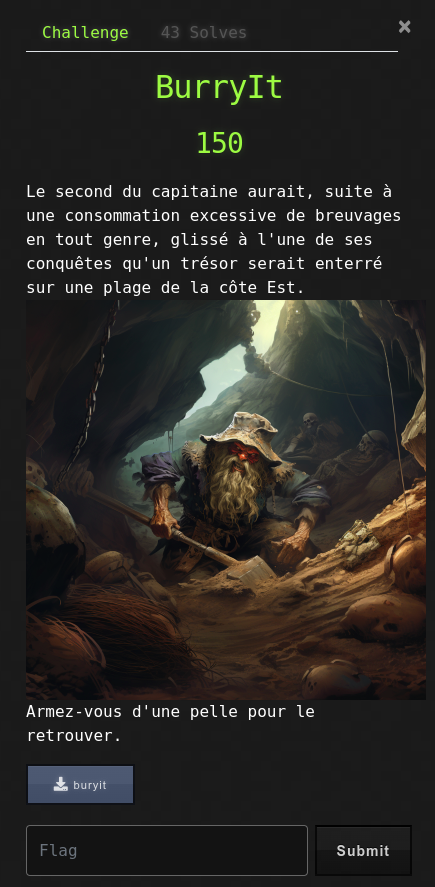

# BurryIt



## Write-Up

Le challenge nous met à disposition un fichier dans lequel nous devons extraire le flag.
Il est possible de chercher à savoir de quel type de fichier il s'agit via un `file`.

```
$ file buryit
buryit: gzip compressed data, last modified: Wed Nov 30 10:21:40 2022, max compression, original size modulo 2^32 81178
```

Le fichier est compressé via gzip, nous tentons d'extraire son contenu avec `zcat` donc afin de voir plus loin ce qu'il nous donne.

```
$ zcat buryit > buryit2
$ file buryit2
buryit2: gzip compressed data, last modified: Wed Nov 30 10:21:40 2022, max compression, original size modulo 2^32 81296
```

Encore un fichier compressé en gzip, nous continuons de décompresser.

```
$ zcat buryit2 > buryit3
$ file buryit3
buryit3: XZ compressed data, checksum CRC64
```

Cette fois-ci, le fichier est compressé en XZ. Nous continuons plusieurs décompressions, il semblerait que le fichier soit du GZ ou du XZ :

```
$ xz -d buryit3 -c > buryit4
$ file buryit4
buryit4: XZ compressed data, checksum CRC64
$ xz -d buryit4 -c > buryit5
$ file buryit5
buryit5: XZ compressed data, checksum CRC64
$ xz -d buryit5 -c > buryit6
$ file buryit6
buryit6: XZ compressed data, checksum CRC64
$ xz -d buryit6 -c > buryit7
$ file buryit7
buryit7: XZ compressed data, checksum CRC64
$ xz -d buryit7 -c > buryit8
$ file buryit8
buryit8: gzip compressed data, last modified: Wed Nov 30 10:21:40 2022, max compression, original size modulo 2^32 80932
```

Nous écrivons donc un script qui décompresse le fichier tant qu'il est compressé et nous retourne les données une fois qu'elles ne sont plus dans un format XZ ou GZ.

```python
import gzip as gz
import lzma as xz
import filetype

def main():
    with open('buryit', 'rb') as f:
        data = f.read()
        kind = filetype.guess(data)
        while(kind != None):
            if kind.extension == 'gz':
                data = gz.decompress(data)
            else:
                data = xz.decompress(data)
            kind = filetype.guess(data)
        print(data.decode())

if __name__ == '__main__':
    main()
```

Ce qui nous donne :

```
$ python pwn-buryit.py
OPENNC{D4n5_L4_C4P174L3}
```
