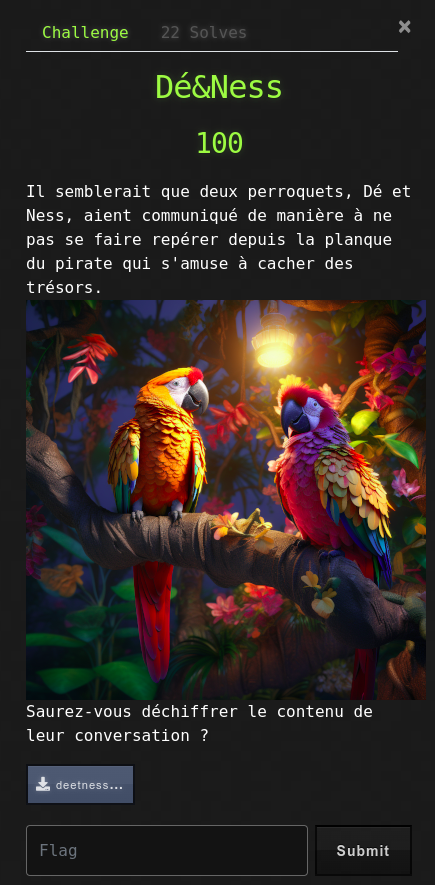
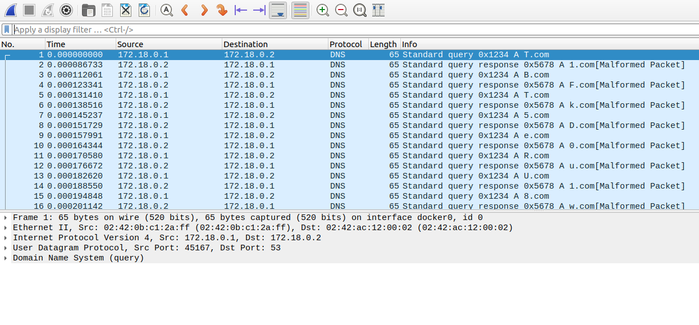

# Dé&Ness



## Write-Up

Le challenge nous met à disposition un fichier pcap dans lequel nous devons extraire le flag.
En l'ouvrant avec wireshark, nous remarquons qu'il s'agit d'échanges DNS entre un client et un serveur.



Les requêtes sont de la forme X.com où X est un caractère qui semble correspondre à la liste de caractères de la base64. Le serveur semble répondre pour une autre adresse de type X.com où X est encore un caractère issu de la base64.

Nous commençons par extraire les adresses ciblées par les requêtes et les réponses avec `tshark`.

```bash
tshark -r deetness.pcapng -Y "dns.qry.name and not mdns" -T fields -e dns.qry.name
T.com
1.com
B.com
F.com
T.com
k.com
5.com
D.com
e.com
0.com
R.com
u.com
U.com
1.com
8.com
w.com
Y.com
m.com
Z.com
V.com
N.com
W.com
M.com
0.com
N.com
z.com
E.com
w.com
b.com
n.com
0.com
=.com
```

Nous extrayons ce qui se trouve avant le .com et concaténons les résultats.

```bash
$ tshark -r deetness.pcapng -Y "dns.qry.name and not mdns" -T fields -e dns.qry.name | awk -F".com" '{print $1}' | tr -d '\n'
T1BFTk5De0RuU18wYmZVNWM0NzEwbn0=
```

Cela confirme ce que nous pensons, il s'agit de base64, nous décodons donc ce message via le oneliner suivant :

```bash
$ tshark -r deetness.pcapng -Y "dns.qry.name and not mdns" -T fields -e dns.qry.name | awk -F".com" '{print $1}' | tr -d '\n' | base64 -d
OPENNC{DnS_0bfU5c4710n}
```
