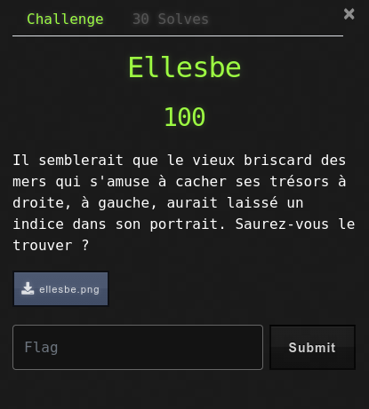
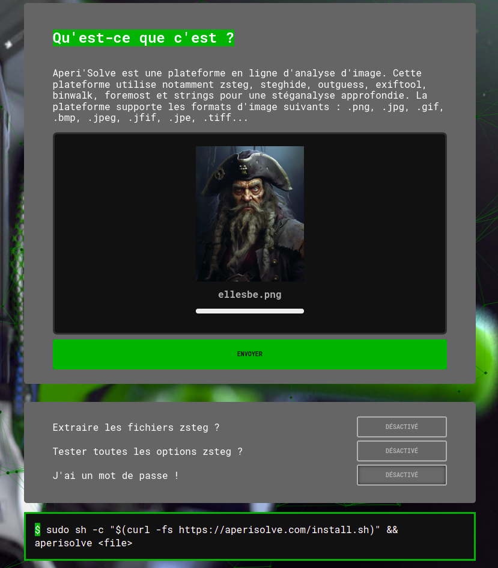
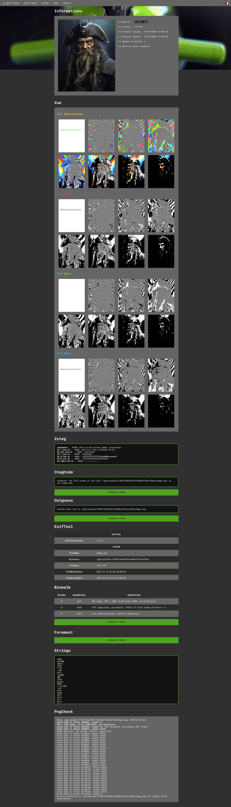
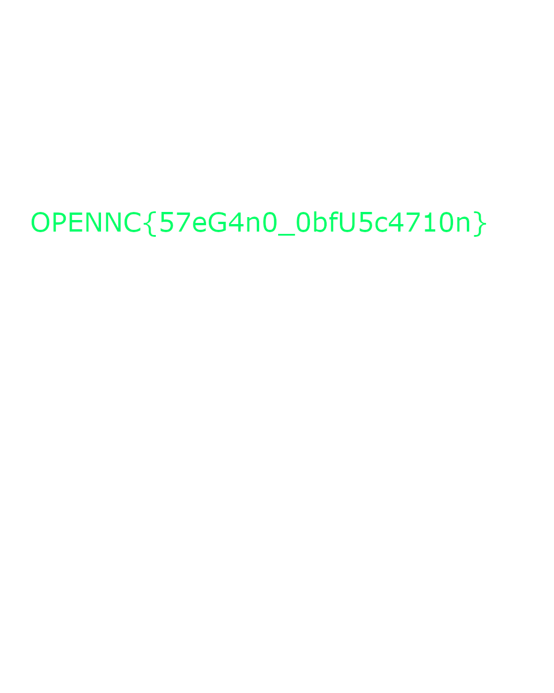

# Ellesbe

## Write-Up

Le challenge nous met à disposition une image de laquelle nous devons extraire le flag.
En général, lorsqu'il s'agit de stéganographie, je pars sur [Aperi'Solve](https://www.aperisolve.com/) afin de ratisser large.

Le résultat apparaît assez vite puisque la première image, issu de la détection de superposition d'images contient le flag.

Le flag est donc :
OPENNC{57eG4n0_0bfU5c4710n}
