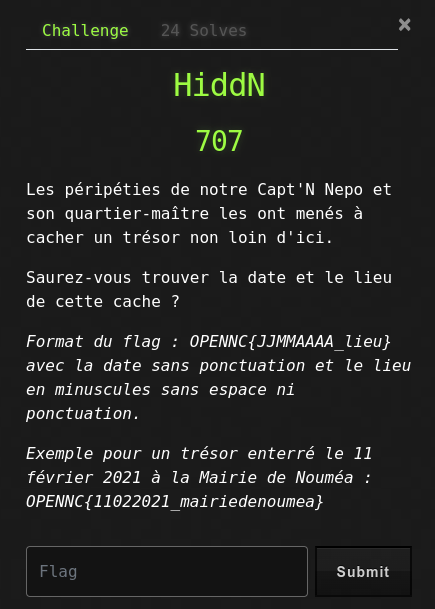
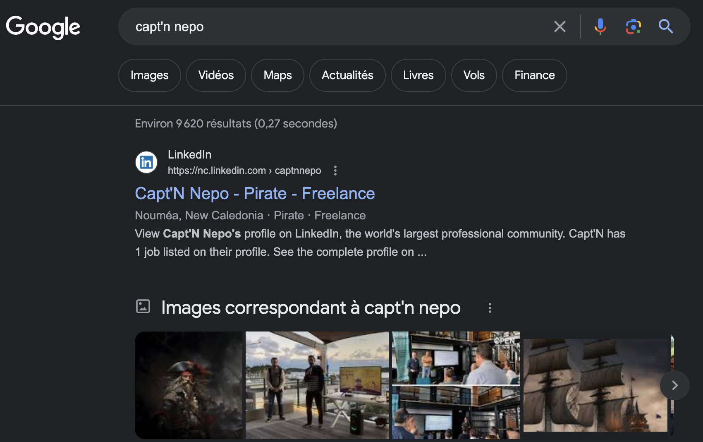
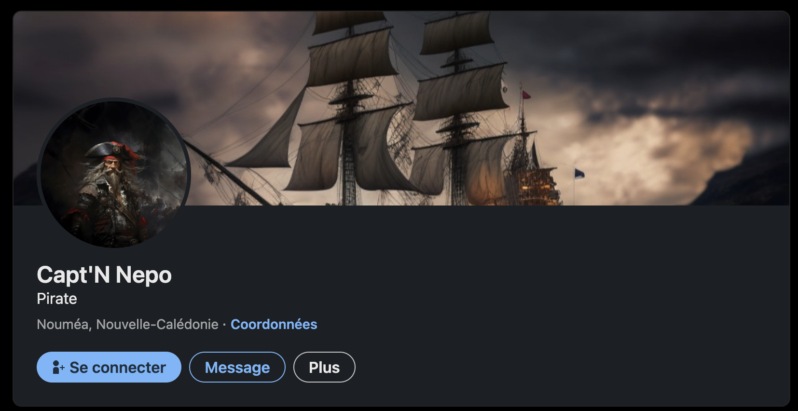
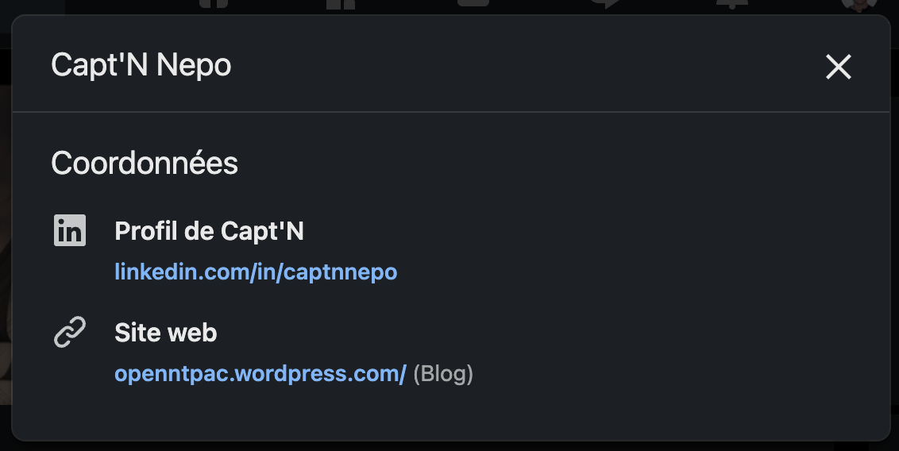
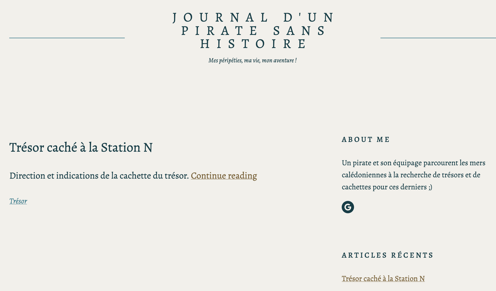
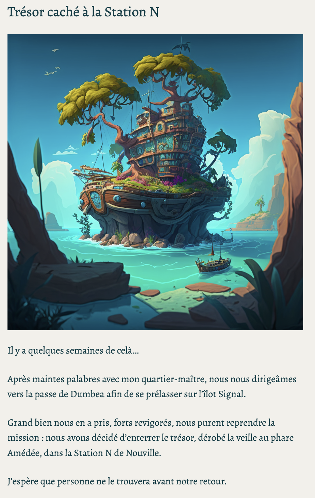
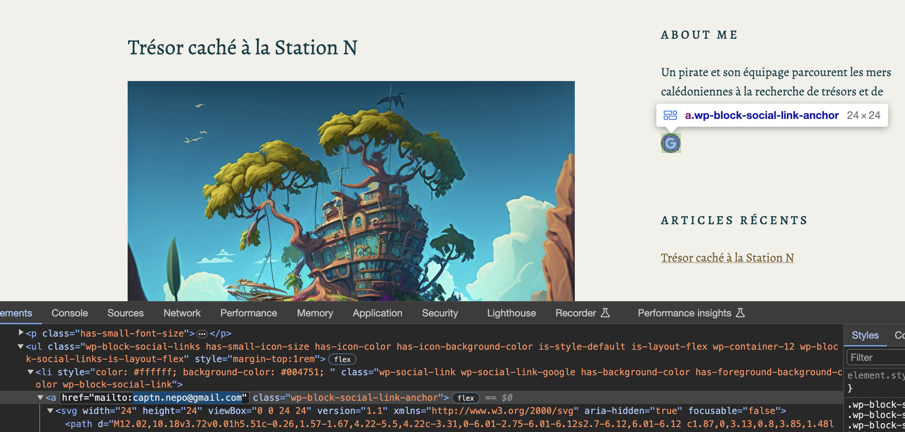
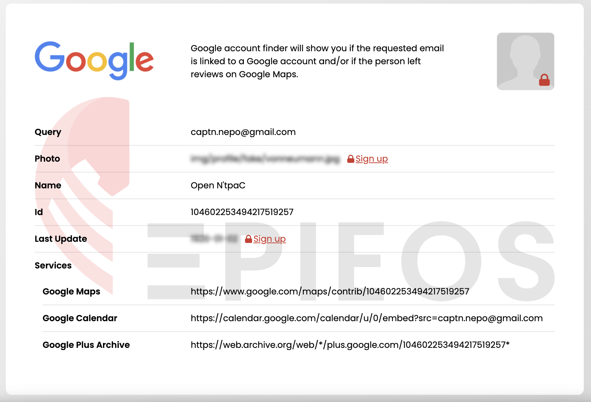
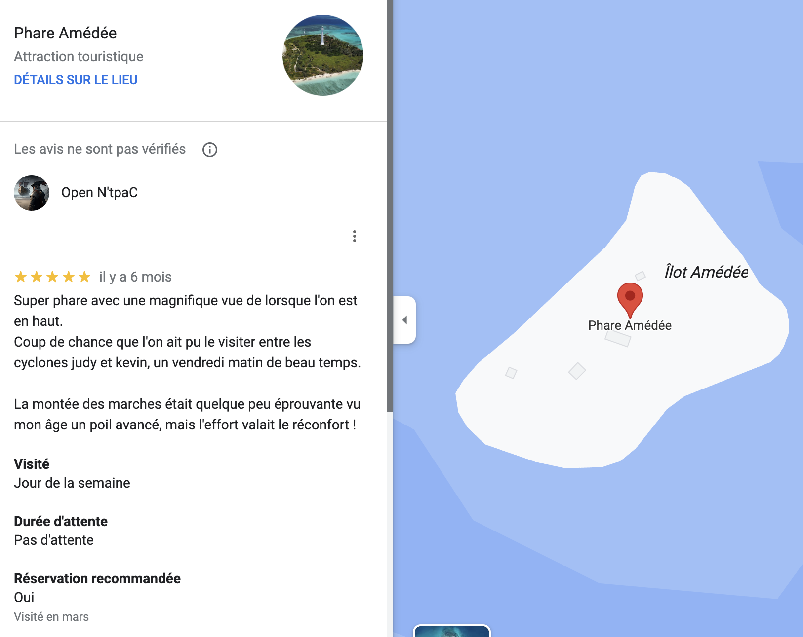
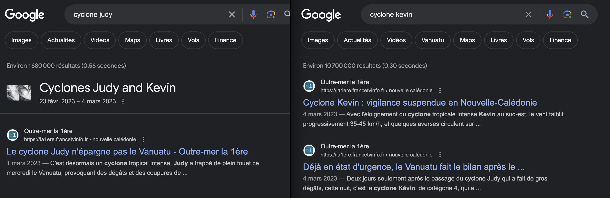

# HiddN

## Write-Up

Le challenge nous demande de rechercher des informations sur le lieu et la date de l'enfouissement d'un trésor par le Capt'N Nepo et son quartier-maître.

Nous commençons donc par une recherche Google du Capt'N Nepo et tombons sur un profil LinkedIn qui semble correspondre au profil du pirate que nous recherchons (https://www.linkedin.com/in/captnnepo/).

En parcourant son profil, nous finissons par trouver l'adresse d'un blog qui semble être le journal de bord du capitaine (https://openntpac.wordpress.com/).

Un article du blog parle d'un trésor qui aurait été caché à la Station N de Nouville. Un premier élément de réponse est ainsi trouvé, le lieu de l'enfouissement. De plus il semblerait que le trésor ait été découvert la veille, au phare Amédée.

Pour trouver la date, il nous faut encore fouiller un peu ce blog pour trouver une adresse email.

Nous allons utiliser un outil d'OSINT qui fonctionne bien avec les comptes Google, Epieos (https://epieos.com).

Un lien vers le profil Google Maps nous permet de trouver une review déposée par le Capt'N sur le Phare Amédée.

On y voit une indication sur la date de leur passage au phare Amédée, notamment par le fait que ce fut un vendredi entre les cyclones Judy et Kevin. Après quelques recherches sur les dates de passage de ces cyclones, on voit qu'ils sont passés sur ou au plus proche de la Nouvelle-Calédonie la première semaine de mars 2023.

Ainsi la date de découverte du trésor étant le vendredi 3 mars 2023, son enfouissement, qui était le lendemain est du 4 mars 2023.

Le flag est donc : OPENNC{04032023_stationn}
