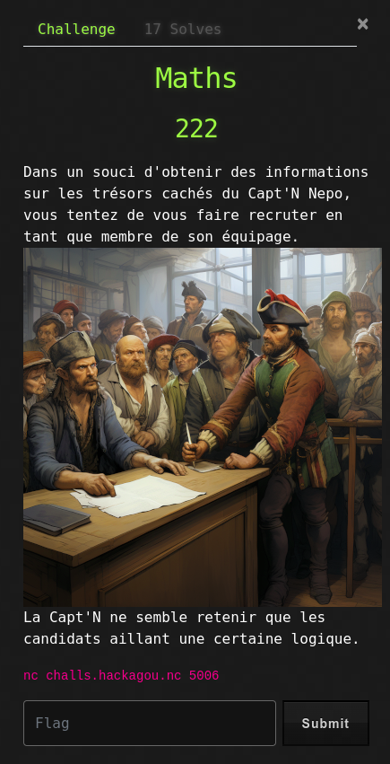

# Maths



## Write-Up

Le challenge nous met à disposition un socket réseau afin d'accéder à une application qui semble être un concours de développement afin de rejoindre l'équipage du Capt'N Nepo.

L'accès à l'application nous donne la sortie suivante :

```bash
$ nc challs.hackagou.nc 5006
Bienvenue sur la plateforme de recrutement de l'équipage du Capt'N Nepo !
Merci de résoudre les équations qui suivent.


[*] (1/200) OTEgLSAzMg==
>> 1
[!] Désolé, tu es trop lent pour le capitaine !
```

Il semblerait qu'il soit nécessaire de résoudre des équations (sûrement 200), un timer semble être en place pour répondre assez rapidement.

La chaîne envoyée correspond à du base64 :

```bash
$ echo -n "OTEgLSAzMg==" | base64 -d
91 - 32
```

Le fait de relancer plusieurs fois l'application nous montre que les équations sont des additions, soustractions ou multiplications de deux membres.

La procédure est donc assez simple :
- Extraire la chaîne base64
- La décoder
- Evaluer l'équation
- Renvoyer le résultat
- Tout ça, 200 fois

Un petit script rapide :

```python
#!/usr/bin/env python3

from pwn import *
import base64

conn = remote('challs.hackagou.nc', 5006)
for i in range(200):
    conn.recvuntil(b'200) ')
    b64 = conn.recvuntil(b'\n')
    conn.recvuntil(b'>> ')
    result = str(eval(base64.b64decode(b64)))
    log.info(f"{i+1}/200 | {base64.b64decode(b64).decode()} = {result}")
    conn.sendline(result.encode('utf-8'))
conn.recvline().decode()
conn.recvline().decode()
conn.recvline().decode()
print(conn.recvline().decode())
```

```bash
$ python pwn-maths.py
[+] Opening connection to challs.hackagou.nc on port 5006: Done
[*] 1/200 | 72 + 21 = 93
[*] 2/200 | 37 + 50 = 87
[*] 3/200 | 69 * 12 = 828
[...]
[*] 194/200 | 52 * 54 = 2808
[*] 195/200 | 87 - 20 = 67
[*] 196/200 | 70 - 52 = 18
[*] 197/200 | 78 - 36 = 42
[*] 198/200 | 66 * 84 = 5544
[*] 199/200 | 47 - 23 = 24
[*] 200/200 | 95 + 42 = 137
Voici ta récompense : OPENNC{K33p_73h_G0oD_W0rK}

[*] Closed connection to challs.hackagou.nc port 5006
```
