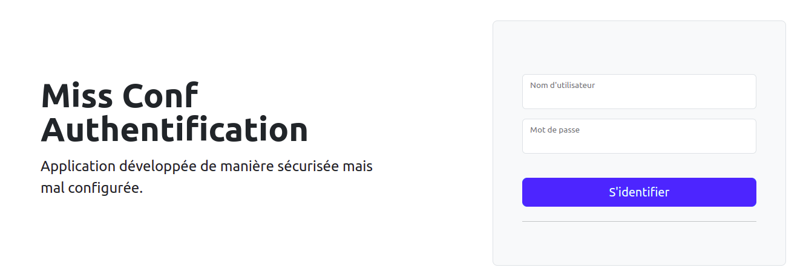
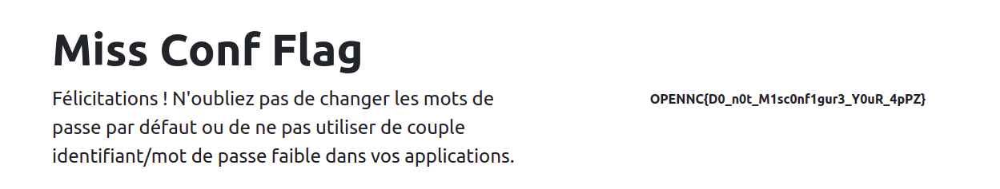

# MissConf

## Write-Up

Le challenge nous met à disposition une URL et nous indique que quelque chose a fait "défaut".

La page d'accueil de l'application web nous montre un formulaire de login. Un message nous indique que l'application est développée de manière sécurisée mais mal configurée.

Cela pourrait être nous amener vers l'hypothèse qu'une mauvaise configuration (misconfiguration) nous permettrait de découvrir le flag.

Selon l'OWASP, la Security Misconfiguration (A05:2021) peut intervenir pour plusieurs raisons :
- Manquements de durcissement de la sécurité approprié sur l'ensemble des couches protocolaires applicatives, ou si les permissions sont mal configurées sur les services cloud
- Fonctionnalités inutiles sont activées ou installées (ex : des ports, des services, des pages, des comptes ou des privilèges inutiles)
- Comptes par défaut et leurs mots de passe sont toujours activés et inchangés
- Traitement des erreurs révèle aux utilisateurs des traces des piles protocolaires ou d'autres messages d'erreur laissant transpirer trop d'informations
- Pour les systèmes à jour ou mis à niveau, les dernières fonctionnalités de sécurité sont désactivées ou ne sont pas configurées de manière sécurisée
- Paramètres de sécurité dans les serveurs d'application, les frameworks applicatifs (ex : Struts, Spring, ASP.NET), les bibliothèques, les bases de données, etc. ne sont pas paramétrés avec des valeurs correctes du point de vue de la sécurité
- Serveur n'envoie pas d'en-têtes ou de directives de sécurité, ou s'ils ne sont pas paramétrés avec des valeurs correctes du point de vue de la sécurité
- Version du logiciel est obsolète ou vulnérable

Ici, ayant affaire à une page d'authentification, nous allons commencer par tester le point concernant les mots de passe des comptes par défaut. Ainsi, nous essayons le couple identifiant / mot de passe :  admin / admin.

Et surprise !

Un flag facile ;)
